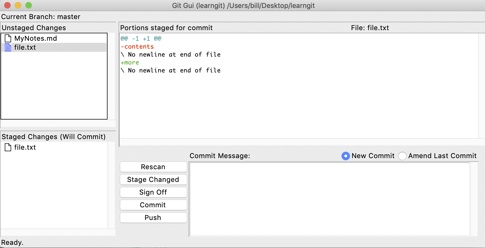
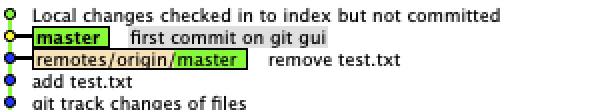

# Notes on git
## using git gui
here is a good link to [gitk usage](https://lostechies.com/joshuaflanagan/2010/09/03/use-gitk-to-understand-git/)
### gitk command
after creating file.txt and git add
modified file.txt

after type
``` 
git
```
I get the following error:
```
Error in startup script: 58:103: execution error: System Events got an error: Application isn’t running. (-600)
    while executing
"exec osascript -e [format {
        tell application "System Events"
            set frontmost of processes whose unix id is %d to true
        end te..."
    invoked from within
"if {[tk windowingsystem] eq "aqua"} {
    exec osascript -e [format {
        tell application "System Events"
            set frontmost of processes ..."
    (file "/usr/local/bin/gitk" line 12212)
```
but if using 
``` 
gitk --all
```
it's fine and the gui started
### exploring the citool
using
```
git citool
```
to get a snapshot of the current file status

Note the file.txt are both in the *Unstaged Changes* and *Staged Changes*
Now in the gui window, select *Repository -> Visualize master's History*
I get the gitk window:

if type in the command line
```
git rm file.txt
```
I get the error message
```
error: the following file has staged content different from both the
file and the HEAD:
    file.txt
(use -f to force removal)
```
so by using 
```
git checkout file.txt
```
then using 
```
git rm file.txt
```
still get the error
```
error: the following file has changes staged in the index:
    file.txt
(use --cached to keep the file, or -f to force removal)
```
it says that the file has changes in the staging index, while the head
has not pointed to that change 


so using the hint
```
git rm --cached file.txt
```
we finally deleted the file.txt from the staging index

type
```
git ls-files
```
output:
```
LICENSE.pages
readme.txt
sample.rtf
```
Note that if using bash command 
``` 
ls
```
we get
```
LICENSE.pages		file.txt		gitk_chec.png		readme.txt
MyNotes.md		git_add_diffFile.png	gitk_diff_File.png	sample.rtf
```

## Notes on markdown
here is a link on how to [load image](https://medium.com/markdown-monster-blog/getting-images-into-markdown-documents-and-weblog-posts-with-markdown-monster-9ec6f353d8ec)
