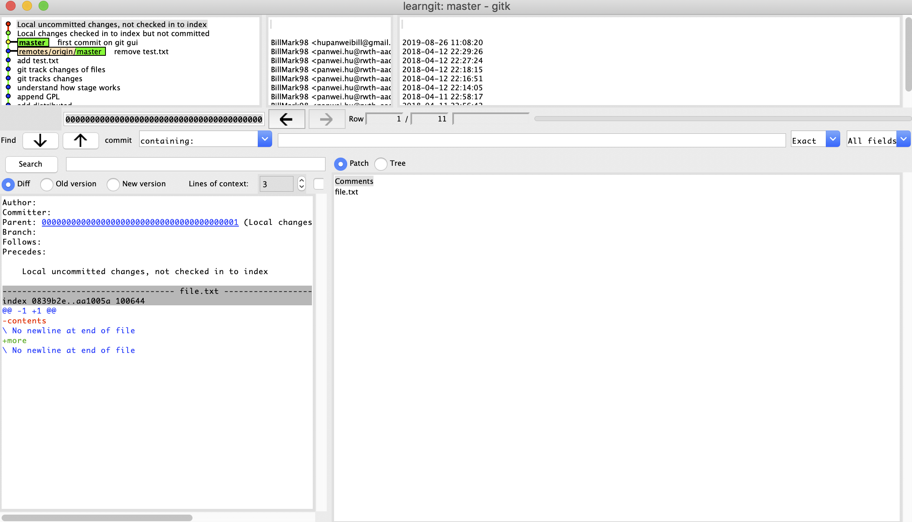

# Notes on git
## chapter 5 using git gui
here is a good link to [gitk usage](https://lostechies.com/joshuaflanagan/2010/09/03/use-gitk-to-understand-git/)
### gitk command
after creating file.txt and git add
modified file.txt

after type
``` 
git
```
I get the following error:
```
Error in startup script: 58:103: execution error: System Events got an error: Application isn’t running. (-600)
    while executing
"exec osascript -e [format {
        tell application "System Events"
            set frontmost of processes whose unix id is %d to true
        end te..."
    invoked from within
"if {[tk windowingsystem] eq "aqua"} {
    exec osascript -e [format {
        tell application "System Events"
            set frontmost of processes ..."
    (file "/usr/local/bin/gitk" line 12212)
```
but if using 
``` 
gitk --all
```
it's fine and the gui started
### exploring the citool
using
```
git citool
```
to get a snapshot of the current file status

Note the file.txt are both in the *Unstaged Changes* and *Staged Changes*
Now in the gui window, select *Repository -> Visualize master's History*
I get the gitk window:

if type in the command line
```
git rm file.txt
```
I get the error message
```
error: the following file has staged content different from both the
file and the HEAD:
    file.txt
(use -f to force removal)
```
so by using 
```
git checkout file.txt
```
then using 
```
git rm file.txt
```
still get the error
```
error: the following file has changes staged in the index:
    file.txt
(use --cached to keep the file, or -f to force removal)
```
it says that the file has changes in the staging index, while the head
has not pointed to that change 


so using the hint
```
git rm --cached file.txt
```
we finally deleted the file.txt from the staging index

type
```
git ls-files
```
output:
```
LICENSE.pages
readme.txt
sample.rtf
```
Note that if using bash command 
``` 
ls
```
we get
```
LICENSE.pages		file.txt		gitk_chec.png		readme.txt
MyNotes.md		git_add_diffFile.png	gitk_diff_File.png	sample.rtf
```

## Notes on markdown
here are links on 
* [how to load image](https://medium.com/markdown-monster-blog/getting-images-into-markdown-documents-and-weblog-posts-with-markdown-monster-9ec6f353d8ec)
* [relationship to html](https://wilsonmar.github.io/markdown-text-for-github-from-html/)

## Notes on GUI
here is a link on graphical commands with [Tcl/Tk](http://tldp.org/HOWTO/Scripting-GUI-TclTk/index.html)

## chapter 7 
### remove file
using `git rm filename` if filename already tracked and committed
and dont have to use `rm` plus `git rm`
### adding parts of changes
initially the file *math.sh*
```
# Comments
a=1
```
now modify that to
```
# Adding two numbers 
a=1
b=2
# output a and 
echo $a
echo $b
let c=$a+$b
echo $c
```
open gui and add lines wanted for commits (cf book p89)
after commit
using `git diff`
the result
```
diff --git a/math.sh b/math.sh
index d0bd5ab..cb73eb4 100644
--- a/math.sh
+++ b/math.sh
@@ -1,5 +1,8 @@
 # Adding two numbers
 a=1
 b=2
+# output a and
+echo $a
+echo $b
 let c=$a+$b
 echo $c
 ```
 To do
 - [ ] how to see file in the commited version(not the one in the working area, using cat)
 - [ ] multiple stages of `git add` how to use `git reset` to come back to a certain changed version ,eg, 3 times of `git add` reset to the second modification


 ## chapter 8
 ### git log
 * example output of `git log --patch`
 ```
 commit b474553295189a451c724f6ee034d2177790a018 (HEAD -> master, origin/master, origin/HEAD)
Author: BillMark98 <hupanweibill@gmail.com>
Date:   Tue Aug 27 14:51:15 2019 +0200

    adding task list with squares

diff --git a/MyNotes.md b/MyNotes.md
index 8683b14..01b51be 100644
--- a/MyNotes.md
+++ b/MyNotes.md
@@ -144,5 +144,5 @@ index d0bd5ab..cb73eb4 100644
  echo $c
```
*To do*
- [ ] how to see file in the commited version(not the one in the working area, using cat)
- [ ] multiple stages of `git add` how to use `git reset` to come back to a certain changed version ,eg, 3 times of `git add` reset to the second modification

* example out put of `git log --stat`
```
commit b474553295189a451c724f6ee034d2177790a018 (HEAD -> master, origin/master, origin/HEAD)
Author: BillMark98 <hupanweibill@gmail.com>
commit b474553295189a451c724f6ee034d2177790a018 (HEAD -> master, origin/master, origin/HEAD)
Author: BillMark98 <hupanweibill@gmail.com>
Date:   Tue Aug 27 14:51:15 2019 +0200

    adding task list with squares

 MyNotes.md | 4 ++--
 1 file changed, 2 insertions(+), 2 deletions(-)
 ```
 * combined version using `git log --patch-with-stat`
 ```
 commit b474553295189a451c724f6ee034d2177790a018 (HEAD -> master, origin/master, origin/HEAD)
Author: BillMark98 <hupanweibill@gmail.com>
Date:   Tue Aug 27 14:51:15 2019 +0200

    adding task list with squares
---
 MyNotes.md | 4 ++--
 1 file changed, 2 insertions(+), 2 deletions(-)

diff --git a/MyNotes.md b/MyNotes.md
index 8683b14..01b51be 100644
--- a/MyNotes.md
+++ b/MyNotes.md
@@ -144,5 +144,5 @@ index d0bd5ab..cb73eb4 100644
  echo $c
  ```
*To do*
- [ ] how to see file in the commited version(not the one in the working area, using cat)
- [ ] multiple stages of `git add` how to use `git reset` to come back to a certain changed version ,eg, 3 times of `git add` reset to the second modification


## git rev-parse
here is a link to discuss the usage of [`git rev-parse`](https://stackoverflow.com/questions/15798862/what-does-git-rev-parse-do)
## git checkout
git checkout to a previous version
do some change e.g `chmod 755 math.sh` (the previous mode is 644)
then `git checkout master`
```
error: Your local changes to the following files would be overwritten by checkout:
	math.sh
Please commit your changes or stash them before you switch branches.
Aborting
```
to do
- [ ] how to delete the changes that has not been staged

## some solutions
list just the most recent N commits? using `git log -n N`