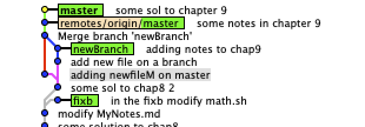
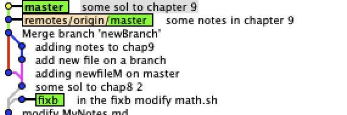

# some solutions to the book *Learn git in a month of lunches*
## chapter 6
1. another way to call ` git diff -- staged`?
```
 git diff --cached
 ```
2. short form of ` git add --dry-run`?
```
 git add -n
 ```
3. display line number via the `cat` command?
```
cat -n filename
```
4. `--oneline` passed to `git log` shorthand for ?
> --pretty=oneline --abbrev-commit
5. `-a` switch to `git commit` is shorthand for?
```
git add --all
```
> by using the -a switch with the commit command to automatically "add" changes from all known files (i.e. all files that are already
           listed in the index) and to automatically "rm" files in the index that have been removed from the working tree, and then perform the
           actual commit

## chapter 7
## some solutions
### 8.5.1
2.  list just the most recent N commits? using `git log -n N`
3.  display the date as time relative to the current time (for example 2 hours ago)?  `git log --date=relative`
4.  `--oneline` passed to `git log` shorthand for ?
> --pretty=oneline --abbrev-commit

### 8.5.3

output for `git rev-parse master^3`
> the corresponding SHA1 ID for the last but three commit
output for ` git show master@{3}`
```
commit bb6bf3694cface50d7f508917ebb5e0878e542ef
Author: BillMark98 <hupanweibill@gmail.com>
Date:   Wed Aug 28 15:59:48 2019 +0200

    for math.sh:
    Adding printf
    This is to make the output more human readble

    printf is part of BASH, works just like in C

    for MyNotes.md
    adding notes on git log

diff --git a/.DS_Store b/.DS_Store
new file mode 100644
index 0000000..135b522
Binary files /dev/null and b/.DS_Store differ
diff --git a/MyNotes.md b/MyNotes.md
index 01b51be..4e2dfc0 100644
--- a/MyNotes.md
+++ b/MyNotes.md
@@ -145,4 +145,70 @@ index d0bd5ab..cb73eb4 100644
  
  To do
  ```
output for `git show master^^^ `  (output the same as above)
```
commit bb6bf3694cface50d7f508917ebb5e0878e542ef
Author: BillMark98 <hupanweibill@gmail.com>
Date:   Wed Aug 28 15:59:48 2019 +0200

    for math.sh:
    Adding printf
    This is to make the output more human readble

    printf is part of BASH, works just like in C

    for MyNotes.md
    adding notes on git log

diff --git a/.DS_Store b/.DS_Store
new file mode 100644
index 0000000..135b522
Binary files /dev/null and b/.DS_Store differ
diff --git a/MyNotes.md b/MyNotes.md
index 01b51be..4e2dfc0 100644
--- a/MyNotes.md
+++ b/MyNotes.md
@@ -145,4 +145,70 @@ index d0bd5ab..cb73eb4 100644
  ```
  To do
  ```

works also if additional tag is added (will display it)
e.g
```
commit bb6bf3694cface50d7f508917ebb5e0878e542ef (tag: printF)
Author: BillMark98 <hupanweibill@gmail.com>
Date:   Wed Aug 28 15:59:48 2019 +0200

    for math.sh:
    Adding printf
    This is to make the output more human readble

    printf is part of BASH, works just like in C

    for MyNotes.md
    adding notes on git log

diff --git a/.DS_Store b/.DS_Store
new file mode 100644
index 0000000..135b522
Binary files /dev/null and b/.DS_Store differ
diff --git a/MyNotes.md b/MyNotes.md
index 01b51be..4e2dfc0 100644
--- a/MyNotes.md
+++ b/MyNotes.md
@@ -145,4 +145,70 @@ index d0bd5ab..cb73eb4 100644
  ```
  To do
  ```

 ` git rev-parse :/" MESSAGE "` will display the SHA1 ID according to the commit with commit message which contains a substring of MESSAGE
 like `git rev-parse :/" chap8"`
 will display the SHA1 ID with corresponding commit message "some solution to chap8"

 ### 8.5.4
 first the local ouput of the latest 4 commits
 ```
 075bae0 (HEAD -> master, origin/master, origin/HEAD) some sol to chap8 2
4a48087 modify MyNotes.md
1169567 some solution to chap8
0d8a85c (tag: revNotes) add git rev-parse note on MyNotes.md
```
Then checkout to the `revNotes` tag
```
0d8a85c (HEAD, tag: revNotes) add git rev-parse note on MyNotes.md
bb6bf36 (tag: printF) for math.sh: Adding printf This is to make the output more human readble
b474553 adding task list with squares
```
Then create a temp file and commit it
after using `git checkout master`
get following message :
```
Warning: you are leaving 1 commit behind, not connected to
any of your branches:

  ac8ba9e detached commit

If you want to keep it by creating a new branch, this may be a good time
to do so with:

 git branch <new-branch-name> ac8ba9e
 ```
 and by looking at the gitk, the commitment in the detached state vanished and the file could not be found either.
 
 So generally the file commited in the detached state will be deleted when we checkout out to master

 ### 8.5.5
 delete a tag? using `git tag -d TAGNAME`

 ## chapter 9
 ### 9.5.2
 options of `git log`
 * `--abbrev-commit` abbreviate the commit message, e.g 
 ```git
 commit e57d80e (HEAD -> master, origin/master, origin/HEAD)
Author: BillMark98 <hupanweibill@gmail.com>
Date:   Thu Sep 5 17:44:59 2019 +0200
.....

```
instead of 
```bash
commit e57d80e619fa4c2005f2e9048b513c4ccb265c44 (HEAD -> master, origin/master, origin/HEAD)
Author: BillMark98 <hupanweibill@gmail.com>
Date:   Thu Sep 5 17:44:59 2019 +0200
.....
```
2. retrieve the commit id from the commit message, 
use the command `git rev-parse :/"some words"`  
for example:
```git
panwei@inets-PC:~/Desktop/learngit$ git log --oneline
dfdbb2c (HEAD -> master, origin/master, origin/HEAD) add info for the language setting
804cfdc some notes chapter 11
558876e adding notes and some solutions to chap10
53c3eb4 some sol to chap 9 ok
0f01e09 some sol to chapter 9
e57d80e some notes in chapter 9
3d950ee Merge branch 'newBranch'
```
```git
panwei@inets-PC:~/Desktop/learngit$ git rev-parse :/"chapter 11"
804cfdcbbd6479efe50617cbf0f45cfd5fc95e26
```
see [here](https://stackoverflow.com/questions/25236100/get-commit-id-from-commit-message-git/25236177)
* `--all` (according to man page)
>   Pretend as if all the refs in refs/, along with HEAD, are listed on the command line as         <commit>   
4. what happens to commits of a branch if branch deleted?
> the commits will still remain 

see the picture of the two
the first is the branch plot before the deletion of the branch `newBranch`  
   
the second is the branch plot after the deletion of the branch `newBranch`  
  
We see that the commits still remain.

### 9.5.3
1. `git checkout branchname` checkout the HEAD to that branch while
    ` git checkout -- <filename>` checkout the file to the latest commited version

### 9.5.4
3. find the branches corresponds to the tag
e.g for `random_prize_1`
```
git branch --contains $(git rev-parse random_prize_1)
```

## chapter 10
### Lab
4. sample output  
```
M       baz
A       newfile.txt
```  
Note have to perform `git commit` to see the second message

### 10.6.1
usage: `git merge-base A B` get the common ancestor of branch A and B 
e.g  `git merge-base bugfix master` 
output:  (c.f the `lol` plot in 10.6.3)  
```
cafdccf4017057cddc8d386bf87d271414613eea
```   

### 10.6.3
after some changes, the output of the `git lol`  
```
* 314e2d0 (HEAD -> branchM) add brM:
* 25dfb36 (master) Committing bar.
* cef58ee Committing foo.
| * 530f83a (newBranch) add newBr
| * 86856e1 (bugfix) add newfile
| * b4e50fa Ugh, I was dividing by zero!
| * e8b959a Adding echo to check error.
|/
* cafdccf (tag: bug_here) Committing baz.
* 53b5911 Committing the README.
```  

Then performing `git merge bugfix newBranch branchM`  
```
Merge made by the 'recursive' strategy.
 baz         | 3 ++-
 newBr.txt   | 1 +
 newfile.txt | 1 +
 3 files changed, 4 insertions(+), 1 deletion(-)
 create mode 100644 newBr.txt
 create mode 100644 newfile.txt
 ```  
we get the analog message 
And the corresponding commit history :   
```
*   fd14702 (HEAD -> branchM) Merge branch 'newBranch' into branchM
|\
| * 530f83a (newBranch) add newBr
| * 86856e1 (bugfix) add newfile
| * b4e50fa Ugh, I was dividing by zero!
| * e8b959a Adding echo to check error.
* | 314e2d0 add brM:
* | 25dfb36 (master) Committing bar.
* | cef58ee Committing foo.
|/
* cafdccf (tag: bug_here) Committing baz.
* 53b5911 Committing the README.
``` 